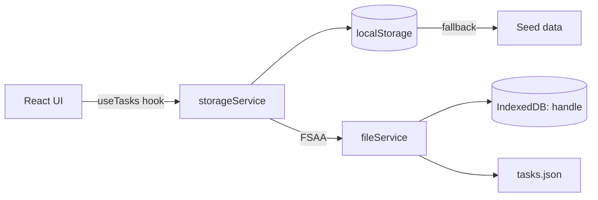

<div align="center">

# ✦ flloisee's task tracker ✦

<a href="https://wishwarrior.github.io/opencode_test"></a> <a href="#"></a> <a href="#"></a> <a href="#"></a> <a href="#"></a> <a href="#"></a> <a href="./LICENSE"></a>

> A **zero-backend** task tracker that writes straight to `tasks.json` on your machine. No server, no database, no API — your files are your persistence layer.

</div>

<br>

---

<br>

<p align="center">
  
  <code>&nbsp;&nbsp;→ http://localhost:5173&nbsp;&nbsp;</code>
  
  <code>&nbsp;&nbsp;→ dist/&nbsp;&nbsp;</code>
  
  <code>&nbsp;&nbsp;→ gh-pages&nbsp;&nbsp;</code>
</p>

```bash
npm install
npm run dev        # local dev
npm run build      # production build
npm run preview    # preview build
npm run deploy     # build + publish to GitHub Pages
```

<br>

---

## 🌳 Architecture

```
flloisee-task-tracker/
│
├── src/                           # ··········· source
│   ├── main.tsx                   #   entry — createRoot(<App />)
│   ├── App/
│   │   ├── App.tsx                #   shell — connection init, layout assembly
│   │   └── App.module.css         #   full-height flex + loading state
│   │
│   ├── hooks/
│   │   └── useTasks.ts            #   ◈ central state — tasks, filters, stats, all CRUD
│   │
│   ├── services/
│   │   ├── fileService.ts         #   File System Access API — IndexedDB handle, read/write tasks.json
│   │   └── storageService.ts      #   cache layer — localStorage ↔ FSAA, seed data, CRUD, export/import
│   │
│   ├── types/
│   │   ├── task.ts                #   Task, TaskFormData, category/priority enums, label & color maps
│   │   └── stats.ts               #   TaskStats interface
│   │
│   ├── utils/
│   │   ├── dates.ts               #   formatDate, isOverdue, isToday, daysUntil
│   │   └── starBurst.ts           #   ✦ micro-animation (Hum #7)
│   │
│   ├── components/
│   │   ├── Nav/                   #   ▣ sticky glassmorphism pill — task count, data menu
│   │   ├── TaskForm/              #   ▣ "What's on your plate?" — title + category + priority + date
│   │   ├── StatsBar/              #   ▣ total · active · done today
│   │   ├── FilterBar/             #   ▣ tab row — category × status
│   │   ├── TaskList/              #   ▣ responsive 2-col grid, staggered slide-in
│   │   │   ├── TaskCard.tsx       #     card — checkbox, inline-editing, slide-out delete
│   │   │   ├── CategoryBadge.tsx  #     tinted pill per category
│   │   │   └── DueDateBadge.tsx   #     formatted date + overdue/due-soon
│   │   ├── EmptyState/            #   ▣ dot character with contextual mood + message
│   │   ├── ConnectFolderBanner/   #   ▣ CTA to connect a folder via FSAA
│   │   ├── DataManager/           #   ▣ flyout — connection, export, import, reconnect
│   │   └── Footer/                #   ▣ inline credit
│   │
│   └── styles/
│       ├── tokens.css             #   design tokens — OKLCH colors, 4pt spacing, motion, radii
│       └── globals.css            #   reset, focus-visible, star-burst keyframes, reduced motion
│
├── data/
│   └── tasks.json                 # ··········· seed (3 tasks) + write target
│
├── public/
│   └── .nojekyll                  # ··········· GitHub Pages marker
│
├── .github/workflows/
│   └── deploy.yml                 # ··········· CI: build & deploy on push to main
│
├── index.html                     # ··········· HTML shell with Google Fonts
├── vite.config.ts                 # ··········· React plugin, ignores data/ for HMR
├── tsconfig.json                  # ··········· project references
├── tsconfig.app.json              # ··········· app config (ES2023, DOM, bundler mode)
├── tsconfig.node.json             # ··········· node config (Vite)
├── package.json                   # ··········· deps: react 19, react-dom 19
└── .gitignore
```

<br>

---

## 🔁 Data flow



Every mutation → `localStorage` first → FSAA sync if connected. Zero network, zero backend.

<br>

---

## 🎨 Design system

<p align="center">
  
  
  
</p>

| Element | Token | Detail |
|---------|-------|--------|
| **Nav** | `N5` | Floating sticky pill — glassmorphism (`backdrop-filter: blur`), round pill shape |
| **Footer** | `Ft2` | Inline monospace, centered, subtle rule above |
| **Enrichment** | `E2` | Dot character (3 moods) in EmptyState + star-burst ✦ on add |
| **Type** | `--font-display` / `--font-mono` | Plus Jakarta Sans (body) · JetBrains Mono (stats, badges, dates) |
| **Spacing** | `--space-*` | 4pt scale — `--space-3xs: 2px` → `--space-4xl: 144px` |
| **Motion** | `--ease-spring` / `--ease-snap` | Spring easing (`0.34, 1.56, 0.64, 1`) — staggered cards, micro-durations |
| **Color** | OKLCH | 6-accent palette — warm gold, cool blue, coral, mint, lavender |
| **Radii** | `--radius-card: 20px` | Generous rounding throughout, `--radius-pill: 999px` for pills |

<br>

---

## ✨ Features

<div align="center">

| | | |
|---|---|---|
| **CRUD** ✓ | add · toggle · inline-edit (double-click) · delete (slide-out) |
| **Filters** ✓ | category tabs × status tabs — composable, `aria-selected` |
| **Stats** ✓ | total · active · done today (mint highlight) |
| **FSAA** ✓ | pick a folder → app writes `tasks.json` on every change |
| **Export / Import** ✓ | download JSON dump · upload JSON to restore |
| **Seed data** ✓ | 3 sample tasks on first visit (no localStorage) |
| **Responsive** ✓ | single-column ≤480px · 2-col grid ≥600px |
| **Accessible** ✓ | `aria-selected`, `aria-describedby`, `aria-live`, `focus-visible` outlines |
| **Reduced motion** ✓ | `prefers-reduced-motion` — kills all animation |
| **Task card** ✓ | checkbox · priority dot · category badge · due date with overdue/due-soon labels |

</div>

<br>

---

## 🧱 Tech stack

<div align="center">

| Layer | Choice | Why |
|-------|--------|-----|
| **Framework** |  | Latest, no runtime dependencies beyond it |
| **Language** |  | Type safety, `verbatimModuleSyntax`, `erasableSyntaxOnly` |
| **Bundler** |  | Instant HMR, ignores `data/` for dev watch |
| **Lint** |  | Fast Rust-based, zero config |
| **Deploy** |  | CI workflow on push to `main` |
| **Persistence** |  + IndexedDB + localStorage | Three-tier: disk → browser storage → seed |
| **Design** | CSS custom properties (OKLCH) + CSS Modules | Scoped styles, no runtime CSS-in-JS |
| **Fonts** | Plus Jakarta Sans + JetBrains Mono | Google Fonts via `<link>` |
| **Dependencies** |  | `react` + `react-dom` — that's it |

</div>

<br>

---

<div align="center">

<p style="white-space: nowrap;">
✧ ✧ ✧ ✧ ✧ ✧ ✧ ✧ ✧ ✧ ✧ ✧ ✧ ✧ ✧ ✧ ✧ ✧<br>
no backend · no database · no API<br>
your files are your persistence layer<br>
✧ ✧ ✧ ✧ ✧ ✧ ✧ ✧ ✧ ✧ ✧ ✧ ✧ ✧ ✧ ✧ ✧ ✧
</p>

</div>

<p align="center">
  <a href="./LICENSE"></a>
</p>